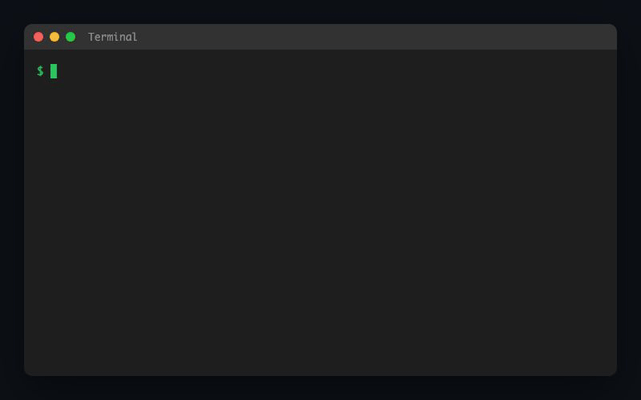

# sqlex

A fast SQL syntax checker and linter written in Rust.



## Features

- **Syntax Checking**: Validates SQL syntax with detailed error messages, source highlighting, and helpful hints
- **Linting**: Enforces SQL style rules (keyword case, SELECT *, trailing semicolons, etc.)
- **Auto-fix**: Automatically formats SQL files
- **Multi-dialect Support**: MySQL, PostgreSQL, SQLite, BigQuery, and generic SQL
- **Internationalization**: English and Japanese message support

## Installation

### Homebrew (macOS/Linux)

```bash
brew install atani/tap/sqlex
```

### From Source

```bash
cargo install --git https://github.com/atani/sqlex
```

### Pre-built Binaries

Download from [GitHub Releases](https://github.com/atani/sqlex/releases).

## Usage

### Check SQL Syntax

```bash
# Check a single file
sqlex check query.sql

# Check all SQL files in a directory
sqlex check ./sql/

# Specify dialect
sqlex check -d postgres queries/
```

### Lint SQL Files

```bash
# Lint with default rules (uppercase keywords, no SELECT *)
sqlex lint query.sql

# Custom lint options
sqlex lint --keyword-case lower --no-select-star false query.sql

# Require table aliases
sqlex lint --require-alias query.sql
```

### Auto-fix SQL Files

```bash
# Preview changes
sqlex fix --dry-run query.sql

# Preview in unified diff format
sqlex fix --dry-run -f diff query.sql

# Apply fixes
sqlex fix query.sql
```

### Language Options

```bash
# Use English messages (default on non-Japanese systems)
sqlex --lang en check query.sql

# Use Japanese messages
sqlex --lang ja check query.sql
```

## Supported Dialects

| Dialect | Flag |
|---------|------|
| Generic SQL | `--dialect generic` (default) |
| MySQL | `--dialect mysql` |
| PostgreSQL | `--dialect postgres` |
| SQLite | `--dialect sqlite` |
| BigQuery | `--dialect bigquery` |

## Lint Rules

| Rule | Description | Default |
|------|-------------|---------|
| `keyword-case` | Enforce keyword case (upper/lower/ignore) | `upper` |
| `no-select-star` | Disallow `SELECT *` | `true` |
| `require-alias` | Require table aliases | `false` |
| `trailing-semicolon` | Require trailing semicolon | `true` |

## Example Output

```
$ sqlex check invalid.sql
✗ invalid.sql - 1 error(s)
  Syntax error (line 5, col 6): sql parser error: Expected an expression, found: FROM
  💡 Line 4 may have a trailing comma that should be removed
3 |   name,
4 |   email,  ← check here
5 | FROM users
  |      ^
6 | WHERE active = 1

Total: 1 file(s), 1 error(s)
```

```
$ sqlex lint --lang ja query.sql
⚠ query.sql - 3 warning(s)
  [keyword-case] 1行目:1列目 - キーワード 'select' は 'SELECT' であるべきです
  [keyword-case] 2行目:1列目 - キーワード 'from' は 'FROM' であるべきです
  [trailing-semicolon] 2行目:12列目 - 文末にセミコロンがありません

合計: 1ファイル, 3件の警告
```

## Exit Codes

| Code | Meaning |
|------|---------|
| 0 | Success, no errors |
| 1 | Errors or warnings found |

## Support

[](https://github.com/sponsors/atani)

## License

MIT
